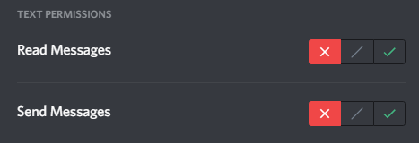
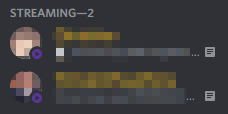

# TSbot
This discord bot attempts to simulate teamspeak in your server(s).

## What it does
Overwrites permissions to allow users access to text channels based on the voice channel they are currently in. It goes off channel names, not IDs to allow for simplicity of creating new channels.

Here are the settings required to hide text channels (from non-admins)



The bot also adds a streaming role if one exists, to any user who has the "STREAMING" status when their presence updates. This is more of a side feature.



## Running

Create an environment variable `DISCORD_BOT_TOKEN` with the bot token.

```
npm i
npm start
```

**NOTE:** If you plan on using this for large servers or multiple servers that happen to have a lot of activity, there are no counter measures for rate limits so be warned.

Having another account act as the server owner would be ideal if you do *not* want to see all hidden channels.